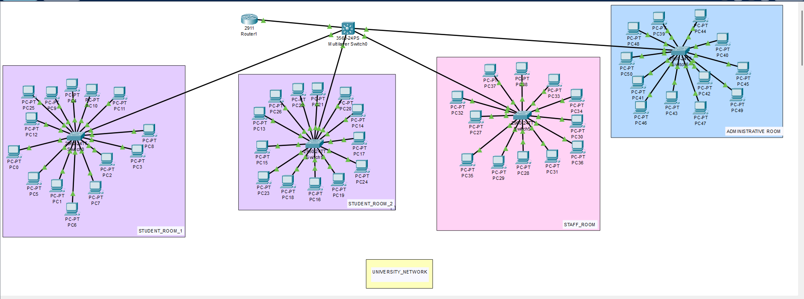

# University_network_simulation
this project simulates a **University Network** using Cisco Packet Tracer. It demonstrates concepts of **IP addressing**, **routing**, and **network connectivity** which are a part of the Computer Networks course.

## objective
- Build an efficient routing topology using Cisco Packet Tracer.
- Understand static and/or dynamic routing between multiple networks.
- Assign IP addresses manually to ensure proper communication between devices.
- Ensure full connectivity across the entire network design.

## tools and technologies
**Cisco Packet Tracer**

## 💡 Key Features
- Properly subnetted IP address scheme
- Configured routing protocols to allow inter-network communication
- Verification of network connectivity using ping commands and simulation mode
## Output Screenshots

### Network Topology

### Ping Success

